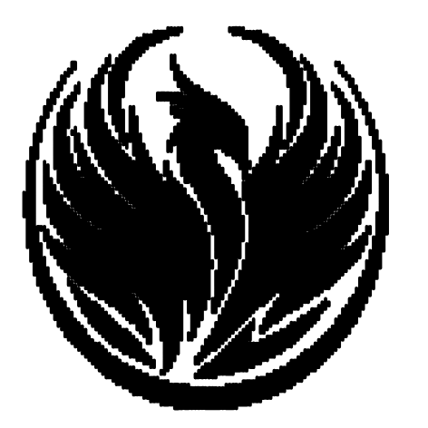

<!-- Improved compatibility of back to top link: See: https://github.com/othneildrew/Best-README-Template/pull/73 -->
<a name="readme-top"></a>
<!--
*** Thanks for checking out the Best-README-Template. If you have a suggestion
*** that would make this better, please fork the repo and create a pull request
*** or simply open an issue with the tag "enhancement".
*** Don't forget to give the project a star!
*** Thanks again! Now go create something AMAZING! :D
-->


<!-- PROJECT SHIELDS -->
<!--
*** I'm using markdown "reference style" links for readability.
*** Reference links are enclosed in brackets [ ] instead of parentheses ( ).
*** See the bottom of this document for the declaration of the reference variables
*** for contributors-url, forks-url, etc. This is an optional, concise syntax you may use.
*** https://www.markdownguide.org/basic-syntax/#reference-style-links
-->
[![Contributors][contributors-shield]][contributors-url]
[![Forks][forks-shield]][forks-url]
[![Stargazers][stars-shield]][stars-url]
[![Issues][issues-shield]][issues-url]
[![MIT License][license-shield]][license-url]
[![LinkedIn][linkedin-shield]][linkedin-url]


<!-- PROJECT LOGO -->
<br />
<div align="center">
  <a href="https://github.com/TSKoduru/BLOT">
    
  </a>

<h3 align="center">BLOT</h3>

  <p align="center">
    Submission for HackClub's BLOT project.
    <br />
    <a href="https://github.com/TSKoduru/BLOT"><strong>Explore the docs »</strong></a>
    <br />
    <br />
    <a href="https://github.com/TSKoduru/BLOT">View Demo</a>
    ·
    <a href="https://github.com/TSKoduru/BLOT/issues">Report Bug</a>
    ·
    <a href="https://github.com/TSKoduru/BLOT/issues">Request Feature</a>
  </p>
</div>


<!-- TABLE OF CONTENTS -->
<details>
  <summary>Table of Contents</summary>
  <ol>
    <li>
      <a href="#about-the-project">About The Project</a>
      <ul>
        <li><a href="#built-with">Built With</a></li>
      </ul>
    </li>
    <li>
      <a href="#getting-started">Getting Started</a>
      <ul>
        <li><a href="#prerequisites">Prerequisites</a></li>
        <li><a href="#installation">Installation</a></li>
      </ul>
    </li>
    <li><a href="#usage">Usage</a></li>
    <li><a href="#roadmap">Roadmap</a></li>
    <li><a href="#contributing">Contributing</a></li>
    <li><a href="#license">License</a></li>
    <li><a href="#contact">Contact</a></li>
    <li><a href="#acknowledgments">Acknowledgments</a></li>
  </ol>
</details>


<!-- ABOUT THE PROJECT -->
## About The Project

![Example Image Output 1][blue-screenshot]


<p align="right">(<a href="#readme-top">back to top</a>)</p>

This is a quick series of programs I created for the BLOT project. HackerClub put out a drawing CNC machine, with the challenge of creating a program to generate art for it. The purpose of this repo is to allow anyone to upload a (square-shaped) image and get an output that they can use to create art with BLOT. The programs are written in Python and JavaScript, and are designed to be as simple as possible to use. I hope you enjoy using them!

### Built With

* [](https://www.python.org/)
* [](https://pillow.readthedocs.io/en/stable/)
* [](https://www.javascript.com/)
* [](https://nodejs.org/)


<p align="right">(<a href="#readme-top">back to top</a>)</p>


<!-- GETTING STARTED -->
## Getting Started


### Prerequisites

All you'll need to get started is to have Python, PIL, and Node.js installed on your machine. You can install them by following the instructions below:

* Python
  ```sh
  sudo apt-get install python3
  pip install pillow
  ```
* Node.js
  ```sh
  sudo apt-get install nodejs
  ```

You'll also want to grab an image to translate into BLOT art. There's a few examples in the images folder to get you started. If you want to use your own, try getting a .png - they don't suffer from compression artifacts like .jpgs do. Also, try using a square image for the best results.

### Installation

1. Clone the repo
   ```sh
    git clone TSKoduru/BLOT
   ```
   

<p align="right">(<a href="#readme-top">back to top</a>)</p>


<!-- USAGE EXAMPLES -->
## Usage

You only need to run two commands to get an image ready for blot. First, we'll run the preprocessor.py script to convert the image to a 2D greyscaled image. Basically, we're taking the color out of images so that we can draw them with just a pen. Then, we'll run blot.js to convert the greyscaled image to a series of commands that the BLOT machine can understand.

Finally, you can paste the output into the provided template and run that in the BLOT interface, located at [https://blot.hackclub.com/editor?guide=start](https://blot.hackclub.com/editor?guide=start).

Here's all you need to copy (Make sure to replace the placeholder names.):

```sh
python3 preprocessor.py -i images/your_image.png -o greyscales/your_image_greyscale.png
node blot.js greyscales/your_image_greyscale.png outputs/your_image_output.txt
```

Then, in the template, replace the placeholder with the output from the last command:

```sh
let finalLines = "Whatever's in the output.txt file."
```

Then, you're done! Paste the template into the BLOT editor and watch your image come to life!
Here's a few examples, using the provided images:

![Example Image Output 2][yellow-screenshot]
![Example Image Output 3][red-screenshot]


<p align="right">(<a href="#readme-top">back to top</a>)</p>


<!-- ROADMAP -->
## Roadmap

- [ ] Minor Bugfixes, especially on some black and white images.

See the [open issues](https://github.com/TSKoduru/BLOT/issues) for a full list of proposed features (and known issues).

<p align="right">(<a href="#readme-top">back to top</a>)</p>


<!-- CONTRIBUTING -->
## Contributing

Contributions are what make the open source community such an amazing place to learn, inspire, and create. Any contributions you make are **greatly appreciated**.

If you have a suggestion that would make this better, please fork the repo and create a pull request. You can also simply open an issue with the tag "enhancement".
Don't forget to give the project a star! Thanks again!

1. Fork the Project
2. Create your Feature Branch (`git checkout -b feature/AmazingFeature`)
3. Commit your Changes (`git commit -m 'Add some AmazingFeature'`)
4. Push to the Branch (`git push origin feature/AmazingFeature`)
5. Open a Pull Request

<p align="right">(<a href="#readme-top">back to top</a>)</p>


<!-- LICENSE -->
## License

Distributed under the MIT License. See `LICENSE.txt` for more information.

<p align="right">(<a href="#readme-top">back to top</a>)</p>


<!-- CONTACT -->
## Contact

Teja koduru - [@TJKoduru](https://twitter.com/TJKoduru) - tkoduru@gmail.com

Project Link: [https://github.com/TSKoduru/BLOT](https://github.com/TSKoduru/BLOT)

<p align="right">(<a href="#readme-top">back to top</a>)</p>


<!-- ACKNOWLEDGMENTS -->
## Acknowledgments

* [HackClub's BLOT Project](https://hackclub.com/)

<p align="right">(<a href="#readme-top">back to top</a>)</p>


<!-- MARKDOWN LINKS & IMAGES -->
<!-- https://www.markdownguide.org/basic-syntax/#reference-style-links -->
[contributors-shield]: https://img.shields.io/github/contributors/TSKoduru/BLOT.svg?style=for-the-badge
[contributors-url]: https://github.com/TSKoduru/BLOT/graphs/contributors
[forks-shield]: https://img.shields.io/github/forks/TSKoduru/BLOT.svg?style=for-the-badge
[forks-url]: https://github.com/TSKoduru/BLOT/network/members
[stars-shield]: https://img.shields.io/github/stars/TSKoduru/BLOT.svg?style=for-the-badge
[stars-url]: https://github.com/TSKoduru/BLOT/stargazers
[issues-shield]: https://img.shields.io/github/issues/TSKoduru/BLOT.svg?style=for-the-badge
[issues-url]: https://github.com/TSKoduru/BLOT/issues
[license-shield]: https://img.shields.io/github/license/TSKoduru/BLOT.svg?style=for-the-badge
[license-url]: https://github.com/TSKoduru/BLOT/blob/master/LICENSE.txt
[linkedin-shield]: https://img.shields.io/badge/-LinkedIn-black.svg?style=for-the-badge&logo=linkedin&colorB=555
[linkedin-url]: https://linkedin.com/in/TSKoduru
[yellow-screenshot]: assets/yellow_example.png
[blue-screenshot]: assets/blue_example.png
[red-screenshot]: assets/red_example.png
[Next.js]: https://img.shields.io/badge/next.js-000000?style=for-the-badge&logo=nextdotjs&logoColor=white
[Next-url]: https://nextjs.org/
[React.js]: https://img.shields.io/badge/React-20232A?style=for-the-badge&logo=react&logoColor=61DAFB
[React-url]: https://reactjs.org/
[Vue.js]: https://img.shields.io/badge/Vue.js-35495E?style=for-the-badge&logo=vuedotjs&logoColor=4FC08D
[Vue-url]: https://vuejs.org/
[Angular.io]: https://img.shields.io/badge/Angular-DD0031?style=for-the-badge&logo=angular&logoColor=white
[Angular-url]: https://angular.io/
[Svelte.dev]: https://img.shields.io/badge/Svelte-4A4A55?style=for-the-badge&logo=svelte&logoColor=FF3E00
[Svelte-url]: https://svelte.dev/
[Laravel.com]: https://img.shields.io/badge/Laravel-FF2D20?style=for-the-badge&logo=laravel&logoColor=white
[Laravel-url]: https://laravel.com
[Bootstrap.com]: https://img.shields.io/badge/Bootstrap-563D7C?style=for-the-badge&logo=bootstrap&logoColor=white
[Bootstrap-url]: https://getbootstrap.com
[JQuery.com]: https://img.shields.io/badge/jQuery-0769AD?style=for-the-badge&logo=jquery&logoColor=white
[JQuery-url]: https://jquery.com 
